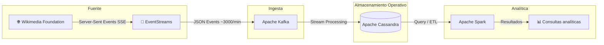

# Proyecto Final - Equipo 1

## Bases de Datos No Relacionales
Proyecto enfocado en el diseño e implementación de una arquitectura de datos no relacional y distribuida de extremo a extremo, utilizando un stream de datos real.

## Índice
- [1. Descripción general del proyecto](#1-descripción-general-del-proyecto)
- [2. Stream seleccionado](#2-stream-seleccionado)
- [3. Arquitectura propuesta](#3-arquitectura-propuesta)
- [4. Tecnologías utilizadas](#4-tecnologías-utilizadas)
- [5. Etapa 2: Infraestructura y configuración](#5-etapa-2-infraestructura-y-configuración)
- [6. Cómo levantar la infraestructura](#6-cómo-levantar-la-infraestructura)
- [7. Seguridad y control de accesos](#7-seguridad-y-control-de-accesos)
- [8. Descripción del stream de datos: Wikimedia RecentChange](#8-descripción-del-stream-de-datos-wikimedia-recentchange)
  - [8.1 Resumen](#81-resumen)
  - [8.2 Origen y autoría](#82-origen-y-autoría)
  - [8.3 Diccionario de datos](#83-diccionario-de-datos)
  - [8.4 Variables cuantitativas](#84-variables-cuantitativas)
  - [8.5 Variables cualitativas](#85-variables-cualitativas)
  - [8.6 Texto no estructurado](#86-texto-no-estructurado)
  - [8.7 Series temporales](#87-series-temporales)
  - [8.8 Consideraciones éticas](#88-consideraciones-éticas)

## 1. Descripción general del proyecto
El proyecto tiene como objetivo diseñar e implementar una arquitectura de datos no relacional y distribuida de extremo a extremo, a partir de un stream de datos real. La solución contempla una capa de ingesta, una capa operativa de almacenamiento y una capa analítica para el procesamiento posterior de los eventos.

## 2. Stream seleccionado
Se utilizará el stream **Wikimedia EventStreams - RecentChange**, el cual genera eventos en tiempo real sobre cambios recientes en páginas de Wikimedia.

## 3. Arquitectura propuesta
El flujo general del sistema es el siguiente:

Wikimedia EventStreams → Kafka → Cassandra → Spark → Consultas analíticas



## 4. Tecnologías utilizadas

### Apache Kafka
Se utiliza como capa de mensajería para recibir y desacoplar el flujo de eventos en tiempo real.

### Apache Cassandra
Se utiliza como base de datos NoSQL de ingesta y operación, optimizada para escritura rápida, alta disponibilidad y escalabilidad horizontal.

### Apache Spark
Se utiliza como motor de procesamiento analítico para limpieza, transformación y preparación de consultas agregadas.

## 5. Etapa 2: Infraestructura y configuración
En esta etapa se definió la infraestructura base del proyecto:

- Kafka como sistema de ingesta y buffer de eventos
- Cassandra como capa operativa de verdad
- Spark como capa analítica (OLAP)
- Scripts y archivos de configuración para despliegue
- Documentación de arquitectura y decisiones CAP
- Archivos de ejemplo para control de accesos

## 6. Cómo levantar la infraestructura

```bash
docker compose up -d
```

## 7. Seguridad y control de accesos
Para la etapa 2 se incluye un archivo `roles.cql` que documenta la estrategia de control de accesos en Cassandra mediante roles y permisos.

Debido a que el contenedor base de Cassandra se encuentra en configuración por defecto, la autenticación por usuario/contraseña no está habilitada todavía. Por ello, los roles se incluyen como parte de la documentación de seguridad y como base para una configuración futura más estricta.

De igual forma, el archivo `kafka/acl.sh` documenta la estrategia de control de accesos para Kafka mediante ACLs en un entorno con seguridad habilitada.

## 8. Descripción del stream de datos: Wikimedia RecentChange

### 8.1 Resumen
El stream `recentchange` es un flujo de datos en tiempo real que transmite todos los cambios realizados en los proyectos de Wikimedia, como Wikipedia, Wikidata, Wikimedia Commons y otros. Cada evento representa una acción que ocurre en una página: por ejemplo, una edición, creación de página, categorización o registro de acciones administrativas.

Los eventos se publican continuamente mediante un servicio llamado **EventStreams**, que envía datos estructurados en formato **JSON** a través del protocolo **Server-Sent Events (SSE)**.

Cada registro del stream contiene información como:

- Usuario que realizó el cambio
- Página afectada
- Tipo de acción (edición, creación, log, etc.)
- Comentario del cambio
- Identificadores de revisiones
- Longitud del contenido antes y después
- Marca de tiempo del evento
- Información técnica del servidor y del wiki

Este stream permite observar la actividad global de edición de Wikipedia en tiempo real, lo que resulta útil para:

- análisis de actividad
- monitoreo de bots
- detección de vandalismo
- investigación académica
- aplicaciones de procesamiento de datos en streaming

### 8.2 Origen y autoría
El stream es generado por los sistemas de **MediaWiki**, el software que gestiona Wikipedia y otros proyectos de Wikimedia.

La entidad responsable de recolectar y publicar estos datos es:

**Wikimedia Foundation (WMF)**

Esta organización sin fines de lucro opera los servidores de Wikipedia y mantiene la infraestructura que genera los eventos de cambios recientes.

#### Infraestructura técnica
El flujo de datos funciona de la siguiente manera:

1. Cuando ocurre una modificación en una página de MediaWiki, el sistema registra el evento.
2. Ese evento se envía a la plataforma de eventos.
3. Los eventos se almacenan y distribuyen mediante **Apache Kafka**.
4. El servicio **EventStreams** publica esos eventos en tiempo real a través de HTTP.

### 8.3 Diccionario de datos
Un evento típico del stream contiene atributos como los siguientes:

| Atributo | Significado |
|--------|-------------|
| `$schema` | Identificador del esquema JSON que define la estructura del evento |
| `meta` | Objeto con metadatos técnicos del evento |
| `meta.uri` | URL relacionada con el cambio |
| `meta.id` | Identificador único del evento |
| `meta.dt` | Fecha y hora del evento |
| `meta.stream` | Nombre del stream (`mediawiki.recentchange`) |
| `meta.domain` | Dominio del sitio donde ocurrió el cambio |
| `id` | Identificador del cambio dentro del sistema |
| `type` | Tipo de cambio (`edit`, `new`, `log`, `categorize`, `external`) |
| `namespace` | Espacio de nombres de la página |
| `title` | Título de la página modificada |
| `comment` | Comentario del editor sobre el cambio |
| `timestamp` | Momento en que ocurrió la modificación |
| `user` | Nombre del usuario que realizó la edición |
| `bot` | Indica si el cambio fue realizado por un bot |
| `server_url` | URL del servidor del wiki |
| `server_name` | Nombre del servidor |
| `server_script_path` | Ruta del script de MediaWiki |
| `wiki` | Identificador interno del wiki (por ejemplo, `enwiki`) |

### 8.4 Variables cuantitativas
Los atributos numéricos del stream incluyen:

- `id`
- `namespace`
- `timestamp`
- `partition`
- `offset`
- `revision IDs` (cuando están presentes)
- `old_len` y `new_len` (longitud del contenido antes y después)

Estas variables permiten realizar análisis estadísticos como:

- frecuencia de ediciones
- crecimiento de páginas
- actividad por periodos
- volumen de cambios por wiki

### 8.5 Variables cualitativas
Las variables categóricas incluyen:

- `type` → tipo de cambio (`edit`, `new`, `log`, etc.)
- `user` → nombre del usuario
- `title` → página afectada
- `wiki` → proyecto específico
- `server_name`
- `domain`
- `stream`
- `bot` (`true` / `false`)

Estas variables describen características o etiquetas del evento en lugar de valores numéricos.

### 8.6 Texto no estructurado
Existen campos con texto libre o semi-estructurado, principalmente:

- `comment`
- `parsedcomment`

Estos campos contienen el mensaje que el editor escribió al realizar el cambio, por ejemplo:

- explicación de la modificación
- referencias a secciones editadas
- descripción del cambio

Este tipo de texto puede usarse para **análisis de lenguaje natural (NLP)** o **detección automática de vandalismo**.

### 8.7 Series temporales
El stream incluye varios atributos temporales que permiten analizar la actividad en el tiempo:

| Atributo | Descripción |
|--------|-------------|
| `timestamp` | instante en que ocurrió la edición |
| `meta.dt` | fecha y hora de emisión del evento |
| `meta.offset` | posición temporal dentro del stream |

Estas variables permiten construir:

- series de actividad por minuto u hora
- patrones diarios de edición
- picos de actividad ante eventos noticiosos
- análisis de comportamiento de usuarios

### 8.8 Consideraciones éticas
El procesamiento del stream **Wikimedia RecentChange** implica ciertas consideraciones éticas relacionadas con el uso responsable de los datos.

#### Privacidad y datos sensibles
Aunque los datos del stream son **públicos**, algunos atributos pueden contener información potencialmente sensible, como:

- `user`: nombre del usuario que realizó la edición
- `comment`: mensaje escrito por el editor
- direcciones IP en el caso de usuarios no registrados

El uso de estos datos debe respetar las políticas de privacidad de Wikimedia y evitar la identificación o exposición indebida de usuarios individuales.

#### Riesgos de sesgo
El análisis de los datos puede generar **interpretaciones sesgadas** si no se considera el contexto en el que se producen las ediciones. Por ejemplo:

- algunas comunidades de editores pueden estar más representadas que otras
- ciertos idiomas o wikis pueden tener mayor actividad
- los bots generan grandes volúmenes de cambios que pueden distorsionar métricas de participación humana

Por ello, es importante diferenciar entre **ediciones humanas y automatizadas** al realizar análisis.

#### Uso responsable de los datos
Los datos del stream pueden utilizarse para aplicaciones como:

- monitoreo de actividad
- análisis académico
- investigación en ciencia de datos

Sin embargo, deben evitarse usos que puedan:

- acosar o rastrear usuarios individuales
- generar perfiles personales sin consentimiento
- manipular información o crear herramientas de vigilancia indebida

#### Transparencia y reproducibilidad
Dado que los datos provienen de una plataforma abierta, se recomienda mantener prácticas de **transparencia en el análisis**, documentando:

- los métodos utilizados
- los filtros aplicados
- las limitaciones del dataset

Esto contribuye a un uso ético y responsable de la información disponible en el stream.
