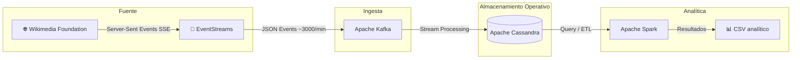

# Proyecto Final - Equipo 1

## Bases de Datos No Relacionales
Proyecto enfocado en el diseño e implementación de una arquitectura de datos no relacional y distribuida de extremo a extremo, utilizando un stream de datos real.

## Índice

- [1. Descripción general del proyecto](#1-descripción-general-del-proyecto)
- [2. Stream seleccionado](#2-stream-seleccionado)
- [3. Arquitectura actual del proyecto](#3-arquitectura-actual-del-proyecto)
- [4. Tecnologías utilizadas](#4-tecnologías-utilizadas)
- [5. Etapa 2: Infraestructura y configuración](#5-etapa-2-infraestructura-y-configuración)
- [6. Etapa 3: Pipeline de datos en tiempo real](#6-etapa-3-pipeline-de-datos-en-tiempo-real)
- [7. Etapa 4: Analítica batch con Spark](#7-etapa-4-analítica-batch-con-spark)
- [8. Cómo levantar y validar el flujo completo](#8-cómo-levantar-y-validar-el-flujo-completo)
- [9. Descripción del stream de datos: Wikimedia RecentChange](#9-descripción-del-stream-de-datos-wikimedia-recentchange)

---

## 1. Descripción general del proyecto
El proyecto tiene como objetivo diseñar e implementar una arquitectura de datos no relacional de extremo a extremo a partir de un stream real de Wikimedia. La solución actual contempla una capa de ingesta, una capa operativa de almacenamiento y una capa analítica reproducible para generar agregados a partir de los eventos capturados.

El estado real del repositorio corresponde a un entorno local y académico, no a una plataforma productiva de alta disponibilidad.

## 2. Stream seleccionado
Se utiliza el stream **Wikimedia EventStreams - RecentChange**, que publica eventos en tiempo real sobre cambios recientes en páginas de Wikimedia.

## 3. Arquitectura actual del proyecto
El flujo general del sistema es el siguiente:

Wikimedia EventStreams → Kafka → Cassandra recent_changes_raw → Spark → CSV analítico



## 4. Tecnologías utilizadas

### Apache Kafka
Se utiliza como capa de mensajería para recibir y desacoplar el flujo de eventos en tiempo real.

### Apache Cassandra
Se utiliza como base de datos NoSQL de ingesta y operación, optimizada para escrituras rápidas. En el estado actual del proyecto se ejecuta en un solo nodo local.

### Apache Spark
Se utiliza como motor de procesamiento batch para limpieza, transformación y generación de resultados agregados reproducibles.

## 5. Etapa 2: Infraestructura y configuración
La infraestructura actual del proyecto se ejecuta con `docker compose` e incluye:

- `zookeeper`
- `kafka`
- `cassandra`
- `cassandra-init`
- `spark-master`
- `spark-worker`

Durante esta etapa quedaron implementados estos puntos:

- volumen persistente para Cassandra
- `healthcheck` del servicio `cassandra`
- inicialización automática del schema con `cassandra-init`
- keyspace `wikimedia`
- tabla legacy `recent_changes` mantenida temporalmente por compatibilidad
- tabla operativa `recent_changes_raw`
- tabla analítica `changes_by_wiki_hour`

## 6. Etapa 3: Pipeline de datos en tiempo real
En esta etapa quedó implementado el flujo:

Wikimedia → Kafka → Cassandra

### Componentes

#### Productor: Wikimedia → Kafka
Script: `consumers/wikimedia_to_kafka.py`

- consume eventos en tiempo real desde Wikimedia EventStreams
- serializa los mensajes en JSON
- publica en el topic `wikimedia.recentchange`
- hace `flush` por lotes simples para no forzar I/O por cada evento

#### Consumidor: Kafka → Cassandra
Script: `consumers/kafka_to_cassandra.py`

- consume mensajes de Kafka con `enable_auto_commit=False`
- usa `group_id` y `auto_offset_reset` configurables por variables de entorno
- transforma cada evento al modelo de `wikimedia.recent_changes_raw`
- usa prepared statements para Cassandra
- deriva `event_date` y `event_hour` a partir de `timestamp_event`
- hace commit manual del offset solo cuando el mensaje fue procesado
- si un mensaje es inválido, lo registra como `SKIP`, hace commit del offset y continúa
- si Cassandra falla al insertar, reintenta y no hace commit del offset si no logra persistir

## 7. Etapa 4: Analítica batch con Spark
En esta etapa se implementó un job Spark real para procesar los datos persistidos en Cassandra.

#### Job analítico
Script principal: `spark/jobs/recent_changes_analytics.py`

- lee desde `wikimedia.recent_changes_raw`
- elimina filas con `timestamp_event`, `wiki`, `event_date` o `event_hour` nulos
- agrupa por `event_date`, `wiki`, `event_hour` y `change_type`
- calcula `total_events`
- calcula `bot_events`
- genera archivos CSV en `spark/output/changes_by_wiki_hour`
- imprime cuántas filas leyó, cuántas sobrevivieron a la limpieza y cuántas filas agregadas produjo

#### Ejecución del job
Script de apoyo: `scripts/run_analytics.sh`

- copia el job al contenedor `spark-master-proyectoFinal`
- ejecuta `spark-submit`
- descarga al host el directorio completo de salida generado por Spark

La escritura opcional de agregados a `wikimedia.changes_by_wiki_hour` existe, pero se mantiene desactivada por defecto. Si se habilita, debe considerarse experimental y no idempotente.

## 8. Cómo levantar y validar el flujo completo

### 8.1 Levantar infraestructura

```bash
docker compose up -d zookeeper kafka cassandra cassandra-init spark-master spark-worker
```

### 8.2 Correr productor y consumer

En terminales separadas:

```bash
python3 consumers/wikimedia_to_kafka.py
```

```bash
python3 consumers/kafka_to_cassandra.py
```

### 8.3 Validar datos en Cassandra

Verificar que la tabla raw ya recibe eventos:

```bash
docker exec cassandra cqlsh -e "SELECT event_date, wiki, event_hour, timestamp_event, source_event_id, title FROM wikimedia.recent_changes_raw LIMIT 10;"
```

Consulta rápida de conteo:

```bash
docker exec cassandra cqlsh -e "SELECT COUNT(*) FROM wikimedia.recent_changes_raw;"
```

### 8.4 Correr analytics

```bash
bash scripts/run_analytics.sh
```

### 8.5 Revisar la salida generada

```bash
ls -R spark/output/changes_by_wiki_hour
```

```bash
head -n 20 spark/output/changes_by_wiki_hour/part-*.csv
```

### 8.6 Seguridad y control de accesos
El repositorio incluye `cassandra/roles.cql` y `kafka/acl.sh` como documentación base de una estrategia de seguridad futura.

Sin embargo, en el entorno actual:

- Cassandra corre con la configuración por defecto del contenedor
- no hay autenticación habilitada en runtime
- no hay ACLs activas de Kafka en ejecución

Por lo tanto, esta seguridad es documental y no una característica operativa del despliegue actual.

### 8.7 Limitaciones del entorno local académico
El proyecto actual debe entenderse como una implementación académica, funcional y reproducible, pero no como una plataforma distribuida productiva.

Limitaciones principales:

- Kafka corre con un solo broker
- Cassandra corre con un solo nodo
- no existe alta disponibilidad real ni failover automático
- no se demuestra particionado real entre nodos
- no hay seguridad enterprise habilitada en ejecución
- Spark se usa como job batch analítico, no como motor principal de streaming
- no hay orquestación externa tipo Airflow ni scheduling de pipelines

### 8.8 Decisiones CAP
La justificación CAP del proyecto se documenta con más detalle en `docs/decisiones_cap.md`.

En síntesis:

- a nivel conceptual, el diseño privilegia disponibilidad y tolerancia a particiones
- a nivel práctico, este repositorio corre en entorno local mononodo, por lo que no demuestra alta disponibilidad real
- Spark consolida el análisis de manera posterior sobre datos ya persistidos

## 9. Descripción del stream de datos: Wikimedia RecentChange

### 9.0 Enlaces a APIs y documentación oficial

| Recurso | URL |
|---|---|
| Endpoint del stream (SSE) | https://stream.wikimedia.org/v2/stream/recentchange |
| Documentación EventStreams | https://wikitech.wikimedia.org/wiki/Event_Platform/EventStreams |
| Catálogo de streams disponibles | https://stream.wikimedia.org/?doc |
| Esquema JSON `mediawiki/recentchange` | https://schema.wikimedia.org/#!/primary/jsonschema/mediawiki/recentchange |
| Documentación de MediaWiki RecentChanges | https://www.mediawiki.org/wiki/Manual:RCFeed |
| Política de uso de la API | https://api.wikimedia.org/wiki/Documentation/Policies/User-Agent |

> El stream se consume por HTTP/SSE sin autenticación, pero la política de Wikimedia exige enviar un `User-Agent` identificable; el productor lo configura vía la variable `USER_AGENT` (`consumers/wikimedia_to_kafka.py`).

### 9.1 Resumen
El stream `recentchange` es un flujo de datos en tiempo real que transmite todos los cambios realizados en los proyectos de Wikimedia, como Wikipedia, Wikidata, Wikimedia Commons y otros. Cada evento representa una acción que ocurre en una página: por ejemplo, una edición, creación de página, categorización o registro de acciones administrativas.

Los eventos se publican continuamente mediante un servicio llamado **EventStreams**, que envía datos estructurados en formato **JSON** a través del protocolo **Server-Sent Events (SSE)**.

Cada registro del stream contiene información como:

- Usuario que realizó el cambio
- Página afectada
- Tipo de acción (edición, creación, log, etc.)
- Comentario del cambio
- Identificadores de revisiones
- Longitud del contenido antes y después
- Marca de tiempo del evento
- Información técnica del servidor y del wiki

Este stream permite observar la actividad global de edición de Wikipedia en tiempo real, lo que resulta útil para:

- análisis de actividad
- monitoreo de bots
- detección de vandalismo
- investigación académica
- aplicaciones de procesamiento de datos en streaming

### 9.2 Origen y autoría
El stream es generado por los sistemas de **MediaWiki**, el software que gestiona Wikipedia y otros proyectos de Wikimedia.

La entidad responsable de recolectar y publicar estos datos es:

**Wikimedia Foundation (WMF)**

Esta organización sin fines de lucro opera los servidores de Wikipedia y mantiene la infraestructura que genera los eventos de cambios recientes.

#### Infraestructura técnica
El flujo de datos funciona de la siguiente manera:

1. Cuando ocurre una modificación en una página de MediaWiki, el sistema registra el evento.
2. Ese evento se envía a la plataforma de eventos.
3. Los eventos se almacenan y distribuyen mediante **Apache Kafka**.
4. El servicio **EventStreams** publica esos eventos en tiempo real a través de HTTP.

### 9.3 Diccionario de datos
Un evento típico del stream contiene atributos como los siguientes:

| Atributo | Significado |
|--------|-------------|
| `$schema` | Identificador del esquema JSON que define la estructura del evento |
| `meta` | Objeto con metadatos técnicos del evento |
| `meta.uri` | URL relacionada con el cambio |
| `meta.id` | Identificador único del evento |
| `meta.dt` | Fecha y hora del evento |
| `meta.stream` | Nombre del stream (`mediawiki.recentchange`) |
| `meta.domain` | Dominio del sitio donde ocurrió el cambio |
| `id` | Identificador del cambio dentro del sistema |
| `type` | Tipo de cambio (`edit`, `new`, `log`, `categorize`, `external`) |
| `namespace` | Espacio de nombres de la página |
| `title` | Título de la página modificada |
| `comment` | Comentario del editor sobre el cambio |
| `timestamp` | Momento en que ocurrió la modificación |
| `user` | Nombre del usuario que realizó la edición |
| `bot` | Indica si el cambio fue realizado por un bot |
| `server_url` | URL del servidor del wiki |
| `server_name` | Nombre del servidor |
| `server_script_path` | Ruta del script de MediaWiki |
| `wiki` | Identificador interno del wiki (por ejemplo, `enwiki`) |

### 9.4 Variables cuantitativas
Los atributos numéricos del stream incluyen:

- `id`
- `namespace`
- `timestamp`
- `partition`
- `offset`
- `revision IDs` (cuando están presentes)
- `old_len` y `new_len` (longitud del contenido antes y después)

Estas variables permiten realizar análisis estadísticos como:

- frecuencia de ediciones
- crecimiento de páginas
- actividad por periodos
- volumen de cambios por wiki

### 9.5 Variables cualitativas
Las variables categóricas incluyen:

- `type` → tipo de cambio (`edit`, `new`, `log`, etc.)
- `user` → nombre del usuario
- `title` → página afectada
- `wiki` → proyecto específico
- `server_name`
- `domain`
- `stream`
- `bot` (`true` / `false`)

Estas variables describen características o etiquetas del evento en lugar de valores numéricos.

### 9.6 Texto no estructurado
Existen campos con texto libre o semi-estructurado, principalmente:

- `comment`
- `parsedcomment`

Estos campos contienen el mensaje que el editor escribió al realizar el cambio, por ejemplo:

- explicación de la modificación
- referencias a secciones editadas
- descripción del cambio

Este tipo de texto puede usarse para **análisis de lenguaje natural (NLP)** o **detección automática de vandalismo**.

### 9.7 Series temporales
El stream incluye varios atributos temporales que permiten analizar la actividad en el tiempo:

| Atributo | Descripción |
|--------|-------------|
| `timestamp` | instante en que ocurrió la edición |
| `meta.dt` | fecha y hora de emisión del evento |
| `meta.offset` | posición temporal dentro del stream |

Estas variables permiten construir:

- series de actividad por minuto u hora
- patrones diarios de edición
- picos de actividad ante eventos noticiosos
- análisis de comportamiento de usuarios

### 9.8 Consideraciones éticas
El procesamiento del stream **Wikimedia RecentChange** implica ciertas consideraciones éticas relacionadas con el uso responsable de los datos.

#### Privacidad y datos sensibles
Aunque los datos del stream son **públicos**, algunos atributos pueden contener información potencialmente sensible, como:

- `user`: nombre del usuario que realizó la edición
- `comment`: mensaje escrito por el editor
- direcciones IP en el caso de usuarios no registrados

El uso de estos datos debe respetar las políticas de privacidad de Wikimedia y evitar la identificación o exposición indebida de usuarios individuales.

#### Riesgos de sesgo
El análisis de los datos puede generar **interpretaciones sesgadas** si no se considera el contexto en el que se producen las ediciones. Por ejemplo:

- algunas comunidades de editores pueden estar más representadas que otras
- ciertos idiomas o wikis pueden tener mayor actividad
- los bots generan grandes volúmenes de cambios que pueden distorsionar métricas de participación humana

Por ello, es importante diferenciar entre **ediciones humanas y automatizadas** al realizar análisis.

#### Uso responsable de los datos
Los datos del stream pueden utilizarse para aplicaciones como:

- monitoreo de actividad
- análisis académico
- investigación en ciencia de datos

Sin embargo, deben evitarse usos que puedan:

- acosar o rastrear usuarios individuales
- generar perfiles personales sin consentimiento
- manipular información o crear herramientas de vigilancia indebida

#### Transparencia y reproducibilidad
Dado que los datos provienen de una plataforma abierta, se recomienda mantener prácticas de **transparencia en el análisis**, documentando:

- los métodos utilizados
- los filtros aplicados
- las limitaciones del dataset

Esto contribuye a un uso ético y responsable de la información disponible en el stream.
