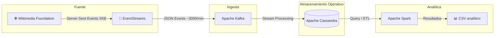

# Proyecto Final - Equipo 1

## Bases de Datos No Relacionales
Proyecto enfocado en el diseño e implementación de una arquitectura de datos no relacional y distribuida de extremo a extremo, utilizando un stream de datos real.

## Índice

- [1. Descripción general del proyecto](#1-descripción-general-del-proyecto)
- [2. Stream seleccionado](#2-stream-seleccionado)
- [3. Arquitectura actual del proyecto](#3-arquitectura-actual-del-proyecto)
- [4. Tecnologías utilizadas](#4-tecnologías-utilizadas)
- [5. Etapa 2: Infraestructura y configuración](#5-etapa-2-infraestructura-y-configuración)
- [6. Etapa 3: Pipeline de datos en tiempo real](#6-etapa-3-pipeline-de-datos-en-tiempo-real)
- [7. Etapa 4: Analítica batch con Spark](#7-etapa-4-analítica-batch-con-spark)
- [8. Cómo levantar y validar el flujo completo](#8-cómo-levantar-y-validar-el-flujo-completo)
- [9. Descripción del stream de datos: Wikimedia RecentChange](#9-descripción-del-stream-de-datos-wikimedia-recentchange)
- [10. Documentos complementarios](#10-documentos-complementarios)

---

## 1. Descripción general del proyecto
El proyecto tiene como objetivo diseñar e implementar una arquitectura de datos no relacional de extremo a extremo a partir de un stream real de Wikimedia. La solución actual contempla una capa de ingesta, una capa operativa de almacenamiento y una capa analítica reproducible para generar agregados a partir de los eventos capturados.

El estado real del repositorio corresponde a un entorno local y académico, no a una plataforma productiva de alta disponibilidad.

## 2. Stream seleccionado
Se utiliza el stream **Wikimedia EventStreams - RecentChange**, que publica eventos en tiempo real sobre cambios recientes en páginas de Wikimedia.

## 3. Arquitectura actual del proyecto
El flujo general del sistema es el siguiente:

Wikimedia EventStreams → Kafka → Cassandra recent_changes_raw → Spark → CSV analítico



## 4. Tecnologías utilizadas

### Apache Kafka
Se utiliza como capa de mensajería para recibir y desacoplar el flujo de eventos en tiempo real.

### Apache Cassandra
Se utiliza como base de datos NoSQL de ingesta y operación, optimizada para escrituras rápidas. En el estado actual del proyecto se ejecuta en un solo nodo local.

### Apache Spark
Se utiliza como motor de procesamiento batch para limpieza, transformación y generación de resultados agregados reproducibles.

## 5. Etapa 2: Infraestructura y configuración

El proyecto ofrece **tres stacks de Docker Compose** según el escenario que se quiera demostrar; todos arrancan con un único comando.

| Archivo | Propósito | Cuándo usarlo |
|---|---|---|
| `docker-compose.yml` | Stack académico mononodo, sin auth | Desarrollo rápido, smoke tests |
| `docker-compose.secure.yml` | Mononodo + control de accesos (Cassandra auth + Kafka SASL/ACL) | Demostrar requisito "Implementación de Control de Accesos" |
| `docker-compose.multinode.yml` | 3 nodos Cassandra con `RF=3` y `NetworkTopologyStrategy` | Demostrar replicación + failover real |

### 5.1 Servicios comunes
- `zookeeper`, `kafka` — capa de mensajería
- `cassandra` (1 o 3 instancias según stack) — capa operativa NoSQL
- `cassandra-init` — aplica `schema.cql` automáticamente
- `spark-master`, `spark-worker` — capa analítica OLAP

Características transversales:
- volumen persistente para cada nodo Cassandra
- `healthcheck` del servicio `cassandra`
- keyspace `wikimedia` con tablas:
  - `recent_changes_raw` (operativa, particionada por `(event_date, wiki, event_hour)`)
  - `changes_by_wiki_hour` (agregada para Spark)
  - `recent_changes` (legacy, conservada por compatibilidad)

### 5.2 Stack mononodo seguro (`docker-compose.secure.yml`)

Cumple el requisito **Implementación de Control de Accesos** del brief.

- Cassandra arranca parcheando `cassandra.yaml` para activar `PasswordAuthenticator` + `CassandraAuthorizer`.
- `cassandra/secure_setup.cql` crea roles con least privilege:
  - `pipeline_writer` — `MODIFY` sobre `recent_changes_raw`, `SELECT` en keyspace
  - `analytics_reader` — solo `SELECT`
  - `analytics_writer` — `MODIFY` sobre `changes_by_wiki_hour`
- Kafka usa `SASL_PLAINTEXT://localhost:9093`, `AclAuthorizer` y `allow.everyone.if.no.acl.found=false`.
- `kafka-acl-init` aplica las ACLs reales (`kafka/secure_acls.sh`) automáticamente.

Detalle completo y comandos de verificación: [docs/seguridad.md](docs/seguridad.md).

### 5.3 Stack multinodo (`docker-compose.multinode.yml`)

Cumple el requisito **alta disponibilidad mediante replicación y sharding** del brief.

- 3 nodos `cassandra-1`, `cassandra-2`, `cassandra-3` en el mismo DC (`dc1`), con vnodes (default `num_tokens=16`) que reparten particiones automáticamente.
- Keyspace creado con `NetworkTopologyStrategy`, `replication_factor=3`. Con `CL=QUORUM` (default del driver), el sistema sobrevive a la caída de cualquier nodo individual.
- Habilita el escenario `cassandra-node-failover` documentado en [docs/resiliencia.md](docs/resiliencia.md).

### 5.4 Justificación CAP

La decisión de priorizar **AP** se documenta en [docs/decisiones_cap.md](docs/decisiones_cap.md) y se materializa en el stack multinodo (con RF=3 el sistema sigue aceptando escrituras durante una partición de 1 nodo).

## 6. Etapa 3: Pipeline de datos en tiempo real
En esta etapa quedó implementado el flujo:

Wikimedia → Kafka → Cassandra

### 6.1 Componentes

#### Productor: Wikimedia → Kafka
Script: [`consumers/wikimedia_to_kafka.py`](consumers/wikimedia_to_kafka.py)

- consume eventos en tiempo real desde Wikimedia EventStreams (SSE)
- serializa los mensajes en JSON
- publica en el topic `wikimedia.recentchange`
- hace `flush` por lotes (`KAFKA_FLUSH_EVERY=100`)
- reconexión SSE con backoff exponencial (1s → 30s)
- soporte opcional `KAFKA_SECURITY_PROTOCOL=SASL_PLAINTEXT` con SASL/PLAIN

#### Consumidor: Kafka → Cassandra
Script: [`consumers/kafka_to_cassandra.py`](consumers/kafka_to_cassandra.py)

- consume mensajes de Kafka con `enable_auto_commit=False`
- usa `group_id` y `auto_offset_reset` configurables por variables de entorno
- transforma cada evento al modelo de `wikimedia.recent_changes_raw`
- usa prepared statements para Cassandra
- deriva `event_date` y `event_hour` a partir de `timestamp_event`
- hace commit manual del offset solo cuando el mensaje fue procesado
- si un mensaje es inválido, lo registra como `SKIP`, hace commit del offset y continúa
- si Cassandra falla al insertar, reintenta hasta `CASSANDRA_INSERT_MAX_RETRIES` y no hace commit del offset si no logra persistir
- soporte opcional `CASSANDRA_USERNAME`/`CASSANDRA_PASSWORD` (driver `PlainTextAuthProvider`)
- soporte opcional `KAFKA_SECURITY_PROTOCOL=SASL_PLAINTEXT`

### 6.2 Garantía de caudal — pruebas de carga

Implementación reproducible en [`tests/load/load_test.py`](tests/load/load_test.py): inyecta eventos sintéticos al topic, espera el drenado del consumer, y compara `enviados a Kafka` vs `vistos en Cassandra` con tolerancia configurable. Falla con exit code distinto de cero si la diferencia supera el umbral.

```bash
python3 tests/load/load_test.py --rate 200 --duration 300 --tolerance-pct 1.0
```

Diseño completo, escenarios y reporte: [tests/load/README.md](tests/load/README.md).

### 6.3 Resiliencia ante fallos

Mecanismos implementados (productor + consumer) y tres escenarios reproducibles:

- `cassandra-restart` — Cassandra cae 30s mientras el consumer está corriendo; verificar 0 pérdida.
- `kafka-restart` — Kafka cae 30s mientras el productor está corriendo; verificar reconexión con backoff.
- `cassandra-node-failover` — sólo en stack multinodo; tirar 1 de 3 nodos y verificar continuidad de escrituras.

```bash
bash scripts/resilience_demo.sh cassandra-restart
bash scripts/resilience_demo.sh kafka-restart
bash scripts/resilience_demo.sh cassandra-node-failover  # requiere docker-compose.multinode.yml
```

Detalle de cada escenario, mecanismos y tabla de resultados: [docs/resiliencia.md](docs/resiliencia.md).

## 7. Etapa 4: Analítica batch con Spark
En esta etapa se implementó un job Spark real para procesar los datos persistidos en Cassandra. El job cumple los tres requisitos del brief: **limpieza**, **enriquecimiento** y **transformación**.

### 7.1 Job analítico
Script principal: [`spark/jobs/recent_changes_analytics.py`](spark/jobs/recent_changes_analytics.py)

Pipeline (cada paso es una función pura testeable):

1. **`read_raw`** — lee `wikimedia.recent_changes_raw` desde Cassandra.
2. **`clean`** — drop de filas sin `timestamp_event`/`wiki`, normalización de `wiki` y `change_type` (lower + trim), cast robusto de `bot` a boolean, validación de `event_hour ∈ [0, 23]`, fallback de `event_date` a partir del timestamp.
3. **`dedupe`** — `dropDuplicates(["event_date", "wiki", "source_event_id"])`, aprovechando que `source_event_id` es estable (`meta.id` o sha1 del payload).
4. **`enrich`** — `LEFT JOIN` con [`data/static/wikis.csv`](data/static/wikis.csv) (catálogo wiki → idioma, país, project_family, community_size_bucket). Wikis no listadas se completan con `unknown` (no se descartan).
5. **`aggregate`** — agrupación por dimensiones temporales + dimensiones de negocio enriquecidas, con métricas: `total_events`, `bot_events`, `unique_users` (countDistinct user), `unique_pages` (countDistinct title).
6. **Escritura** — CSV en `spark/output/changes_by_wiki_hour` (siempre); append a `wikimedia.changes_by_wiki_hour` si `ANALYTICS_WRITE_TO_CASSANDRA=true`.

El job imprime un reporte: filas leídas, tras limpieza, tras dedupe, duplicados eliminados, filas agregadas finales.

### 7.2 Dataset estático

[`data/static/wikis.csv`](data/static/wikis.csv) cubre las wikis con mayor volumen del stream y permite cruzar el evento crudo con metadatos de negocio. Esquema y origen documentados en [data/static/README.md](data/static/README.md).

### 7.3 Tests unitarios

[`tests/spark/test_recent_changes_analytics.py`](tests/spark/test_recent_changes_analytics.py) prueba `clean`, `dedupe`, `enrich` y `aggregate` con DataFrames sintéticos, sin necesidad de Cassandra ni cluster Spark:

```bash
pip install -r tests/requirements.txt
pytest tests/spark -v
```

### 7.4 Ejecución del job

Script de apoyo: [`scripts/run_analytics.sh`](scripts/run_analytics.sh)

- copia el job y el dataset estático al contenedor `spark-master-proyectoFinal`
- ejecuta `spark-submit` con el connector `spark-cassandra-connector_2.13:3.5.1`
- descarga al host el directorio completo de salida generado por Spark

## 8. Cómo levantar y validar el flujo completo

### 8.1 Levantar infraestructura

```bash
docker compose up -d zookeeper kafka cassandra cassandra-init spark-master spark-worker
```

### 8.2 Correr productor y consumer

En terminales separadas:

```bash
python3 consumers/wikimedia_to_kafka.py
```

```bash
python3 consumers/kafka_to_cassandra.py
```

### 8.3 Validar datos en Cassandra

Verificar que la tabla raw ya recibe eventos:

```bash
docker exec cassandra cqlsh -e "SELECT event_date, wiki, event_hour, timestamp_event, source_event_id, title FROM wikimedia.recent_changes_raw LIMIT 10;"
```

Consulta rápida de conteo:

```bash
docker exec cassandra cqlsh -e "SELECT COUNT(*) FROM wikimedia.recent_changes_raw;"
```

### 8.4 Correr analytics

```bash
bash scripts/run_analytics.sh
```

### 8.5 Revisar la salida generada

```bash
ls -R spark/output/changes_by_wiki_hour
```

```bash
head -n 20 spark/output/changes_by_wiki_hour/part-*.csv
```

### 8.6 Seguridad y control de accesos

El control de accesos se entrega como **stack alternativo opt-in** en `docker-compose.secure.yml`:

```bash
docker compose -f docker-compose.secure.yml up -d
docker logs cassandra-init     # debe terminar con "Cassandra inicializado en modo seguro"
docker logs kafka-acl-init     # debe terminar con el listado de ACLs

# Producer/consumer con credenciales
export KAFKA_PORT=9093
export KAFKA_SECURITY_PROTOCOL=SASL_PLAINTEXT
export KAFKA_SASL_USERNAME=pipeline_writer
export KAFKA_SASL_PASSWORD=pipeline_writer_pw
export CASSANDRA_USERNAME=pipeline_writer
export CASSANDRA_PASSWORD=pipeline_writer_pw

python3 consumers/wikimedia_to_kafka.py
python3 consumers/kafka_to_cassandra.py
```

Detalle del modelo (roles, ACLs, comandos de verificación) en [docs/seguridad.md](docs/seguridad.md).

### 8.7 Cluster multinodo y failover

```bash
docker compose -f docker-compose.multinode.yml up -d
# espera ~2 min al bootstrap completo
docker exec cassandra-1 nodetool status
# debe mostrar 3 nodos UN (Up + Normal)

# Demostrar failover (1 nodo down)
bash scripts/resilience_demo.sh cassandra-node-failover
```

### 8.8 Validación integral

Hay un script integrador que valida estáticamente todo el repo y, si Docker está arriba, encadena un smoke test end-to-end:

```bash
bash scripts/verify.sh static     # py_compile + bash -n + docker compose config
bash scripts/verify.sh e2e        # levanta stack default + load test corto
```

### 8.9 Decisiones CAP
La justificación CAP del proyecto se documenta en [docs/decisiones_cap.md](docs/decisiones_cap.md).

En síntesis:

- el diseño privilegia disponibilidad y tolerancia a particiones (AP)
- esa prioridad se materializa **operativamente** en el stack multinodo (`docker-compose.multinode.yml`) con `RF=3` y `NetworkTopologyStrategy`
- el stack mononodo se conserva para desarrollo local
- Spark consolida el análisis de manera posterior sobre datos ya persistidos

### 8.10 Limitaciones reconocidas

- Compose por defecto (`docker-compose.yml`) sigue siendo mononodo y sin auth para que el flujo académico arranque con un solo comando.
- `SASL_PLAINTEXT` envía credenciales sin TLS — apto para entorno académico, no producción.
- No hay orquestación externa tipo Airflow; el scheduling del job analítico se hace manualmente.

## 9. Descripción del stream de datos: Wikimedia RecentChange

### 9.0 Enlaces a APIs y documentación oficial

| Recurso | URL |
|---|---|
| Endpoint del stream (SSE) | https://stream.wikimedia.org/v2/stream/recentchange |
| Documentación EventStreams | https://wikitech.wikimedia.org/wiki/Event_Platform/EventStreams |
| Catálogo de streams disponibles | https://stream.wikimedia.org/?doc |
| Esquema JSON `mediawiki/recentchange` | https://schema.wikimedia.org/#!/primary/jsonschema/mediawiki/recentchange |
| Documentación de MediaWiki RecentChanges | https://www.mediawiki.org/wiki/Manual:RCFeed |
| Política de uso de la API | https://api.wikimedia.org/wiki/Documentation/Policies/User-Agent |

> El stream se consume por HTTP/SSE sin autenticación, pero la política de Wikimedia exige enviar un `User-Agent` identificable; el productor lo configura vía la variable `USER_AGENT` (`consumers/wikimedia_to_kafka.py`).

### 9.1 Resumen
El stream `recentchange` es un flujo de datos en tiempo real que transmite todos los cambios realizados en los proyectos de Wikimedia, como Wikipedia, Wikidata, Wikimedia Commons y otros. Cada evento representa una acción que ocurre en una página: por ejemplo, una edición, creación de página, categorización o registro de acciones administrativas.

Los eventos se publican continuamente mediante un servicio llamado **EventStreams**, que envía datos estructurados en formato **JSON** a través del protocolo **Server-Sent Events (SSE)**.

Cada registro del stream contiene información como:

- Usuario que realizó el cambio
- Página afectada
- Tipo de acción (edición, creación, log, etc.)
- Comentario del cambio
- Identificadores de revisiones
- Longitud del contenido antes y después
- Marca de tiempo del evento
- Información técnica del servidor y del wiki

Este stream permite observar la actividad global de edición de Wikipedia en tiempo real, lo que resulta útil para:

- análisis de actividad
- monitoreo de bots
- detección de vandalismo
- investigación académica
- aplicaciones de procesamiento de datos en streaming

### 9.2 Origen y autoría
El stream es generado por los sistemas de **MediaWiki**, el software que gestiona Wikipedia y otros proyectos de Wikimedia.

La entidad responsable de recolectar y publicar estos datos es:

**Wikimedia Foundation (WMF)**

Esta organización sin fines de lucro opera los servidores de Wikipedia y mantiene la infraestructura que genera los eventos de cambios recientes.

#### Infraestructura técnica
El flujo de datos funciona de la siguiente manera:

1. Cuando ocurre una modificación en una página de MediaWiki, el sistema registra el evento.
2. Ese evento se envía a la plataforma de eventos.
3. Los eventos se almacenan y distribuyen mediante **Apache Kafka**.
4. El servicio **EventStreams** publica esos eventos en tiempo real a través de HTTP.

### 9.3 Diccionario de datos
Un evento típico del stream contiene atributos como los siguientes:

| Atributo | Significado |
|--------|-------------|
| `$schema` | Identificador del esquema JSON que define la estructura del evento |
| `meta` | Objeto con metadatos técnicos del evento |
| `meta.uri` | URL relacionada con el cambio |
| `meta.id` | Identificador único del evento |
| `meta.dt` | Fecha y hora del evento |
| `meta.stream` | Nombre del stream (`mediawiki.recentchange`) |
| `meta.domain` | Dominio del sitio donde ocurrió el cambio |
| `id` | Identificador del cambio dentro del sistema |
| `type` | Tipo de cambio (`edit`, `new`, `log`, `categorize`, `external`) |
| `namespace` | Espacio de nombres de la página |
| `title` | Título de la página modificada |
| `comment` | Comentario del editor sobre el cambio |
| `timestamp` | Momento en que ocurrió la modificación |
| `user` | Nombre del usuario que realizó la edición |
| `bot` | Indica si el cambio fue realizado por un bot |
| `server_url` | URL del servidor del wiki |
| `server_name` | Nombre del servidor |
| `server_script_path` | Ruta del script de MediaWiki |
| `wiki` | Identificador interno del wiki (por ejemplo, `enwiki`) |

### 9.4 Variables cuantitativas
Los atributos numéricos del stream incluyen:

- `id`
- `namespace`
- `timestamp`
- `partition`
- `offset`
- `revision IDs` (cuando están presentes)
- `old_len` y `new_len` (longitud del contenido antes y después)

Estas variables permiten realizar análisis estadísticos como:

- frecuencia de ediciones
- crecimiento de páginas
- actividad por periodos
- volumen de cambios por wiki

### 9.5 Variables cualitativas
Las variables categóricas incluyen:

- `type` → tipo de cambio (`edit`, `new`, `log`, etc.)
- `user` → nombre del usuario
- `title` → página afectada
- `wiki` → proyecto específico
- `server_name`
- `domain`
- `stream`
- `bot` (`true` / `false`)

Estas variables describen características o etiquetas del evento en lugar de valores numéricos.

### 9.6 Texto no estructurado
Existen campos con texto libre o semi-estructurado, principalmente:

- `comment`
- `parsedcomment`

Estos campos contienen el mensaje que el editor escribió al realizar el cambio, por ejemplo:

- explicación de la modificación
- referencias a secciones editadas
- descripción del cambio

Este tipo de texto puede usarse para **análisis de lenguaje natural (NLP)** o **detección automática de vandalismo**.

### 9.7 Series temporales
El stream incluye varios atributos temporales que permiten analizar la actividad en el tiempo:

| Atributo | Descripción |
|--------|-------------|
| `timestamp` | instante en que ocurrió la edición |
| `meta.dt` | fecha y hora de emisión del evento |
| `meta.offset` | posición temporal dentro del stream |

Estas variables permiten construir:

- series de actividad por minuto u hora
- patrones diarios de edición
- picos de actividad ante eventos noticiosos
- análisis de comportamiento de usuarios

### 9.8 Consideraciones éticas
El procesamiento del stream **Wikimedia RecentChange** implica ciertas consideraciones éticas relacionadas con el uso responsable de los datos.

#### Privacidad y datos sensibles
Aunque los datos del stream son **públicos**, algunos atributos pueden contener información potencialmente sensible, como:

- `user`: nombre del usuario que realizó la edición
- `comment`: mensaje escrito por el editor
- direcciones IP en el caso de usuarios no registrados

El uso de estos datos debe respetar las políticas de privacidad de Wikimedia y evitar la identificación o exposición indebida de usuarios individuales.

#### Riesgos de sesgo
El análisis de los datos puede generar **interpretaciones sesgadas** si no se considera el contexto en el que se producen las ediciones. Por ejemplo:

- algunas comunidades de editores pueden estar más representadas que otras
- ciertos idiomas o wikis pueden tener mayor actividad
- los bots generan grandes volúmenes de cambios que pueden distorsionar métricas de participación humana

Por ello, es importante diferenciar entre **ediciones humanas y automatizadas** al realizar análisis.

#### Uso responsable de los datos
Los datos del stream pueden utilizarse para aplicaciones como:

- monitoreo de actividad
- análisis académico
- investigación en ciencia de datos

Sin embargo, deben evitarse usos que puedan:

- acosar o rastrear usuarios individuales
- generar perfiles personales sin consentimiento
- manipular información o crear herramientas de vigilancia indebida

#### Transparencia y reproducibilidad
Dado que los datos provienen de una plataforma abierta, se recomienda mantener prácticas de **transparencia en el análisis**, documentando:

- los métodos utilizados
- los filtros aplicados
- las limitaciones del dataset

Esto contribuye a un uso ético y responsable de la información disponible en el stream.

## 10. Documentos complementarios

| Documento | Contenido |
|---|---|
| [docs/arquitectura.md](docs/arquitectura.md) | Diagrama detallado y descripción de cada componente |
| [docs/decisiones_cap.md](docs/decisiones_cap.md) | Justificación CAP (AP) |
| [docs/seguridad.md](docs/seguridad.md) | Modelo de control de accesos (roles + ACLs) |
| [docs/resiliencia.md](docs/resiliencia.md) | Mecanismos de resiliencia y escenarios reproducibles |
| [tests/load/README.md](tests/load/README.md) | Diseño de la prueba de carga y reporte de referencia |
| [data/static/README.md](data/static/README.md) | Diccionario del dataset estático de enriquecimiento |
