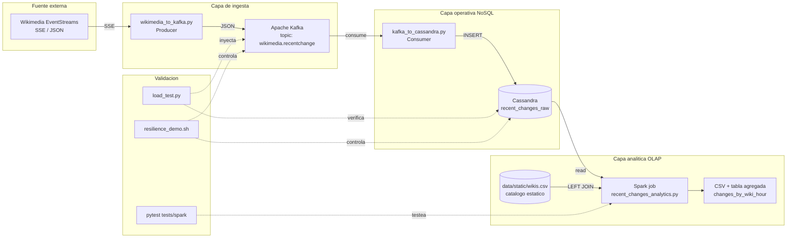

## Descripción general
La arquitectura del proyecto implementa un flujo completo de ingesta, persistencia y análisis sobre el stream Wikimedia RecentChange en un entorno local reproducible, con tres variantes operativas:

- **Mononodo académico** (`docker-compose.yml`) — desarrollo rápido sin auth.
- **Mononodo seguro** (`docker-compose.secure.yml`) — control de accesos real (Cassandra auth + Kafka SASL/ACL).
- **Multinodo** (`docker-compose.multinode.yml`) — Cassandra `RF=3` con `NetworkTopologyStrategy` para failover real.

El flujo lógico es:

`Wikimedia EventStreams → Kafka → consumer Python → Cassandra → Spark (limpieza + dedupe + enrichment) → CSV analítico (+ tabla agregada opcional)`

## Diagrama de arquitectura

## Flujo de datos
1. `consumers/wikimedia_to_kafka.py` consume eventos desde Wikimedia EventStreams (SSE) con backoff exponencial.
2. Los eventos se publican en Kafka en el topic `wikimedia.recentchange`.
3. `consumers/kafka_to_cassandra.py` consume el topic con `enable_auto_commit=False`, deriva `event_date`/`event_hour` y persiste con prepared statement en `wikimedia.recent_changes_raw`. Reintenta inserts y solo confirma offsets tras persistir.
4. `spark/jobs/recent_changes_analytics.py` lee la tabla raw, aplica limpieza, dedupe (`source_event_id`), enrichment con `data/static/wikis.csv` y agregaciones.
5. La salida CSV se guarda en `spark/output/changes_by_wiki_hour`. Opcionalmente se hace append a `wikimedia.changes_by_wiki_hour`.

## Componentes

### Wikimedia EventStreams
Fuente externa de eventos en tiempo real. ~3000 eventos/min en promedio.

### Kafka
Buffer de ingesta. Desacopla el productor SSE del consumer Cassandra y garantiza durabilidad ante caída temporal del consumer.

### Consumer Python
Implementa:
- commit manual de offsets (`enable_auto_commit=False`)
- prepared statements
- reintentos de insert con backoff fijo
- skip de payloads inválidos
- soporte opcional de auth (Cassandra `PlainTextAuthProvider`, Kafka `SASL/PLAIN`)

### Cassandra
Capa operativa. Tablas:
- `recent_changes_raw` — operativa, particionada por `(event_date, wiki, event_hour)`, clustering por `(timestamp_event DESC, source_event_id ASC)`.
- `changes_by_wiki_hour` — agregada, escrita por Spark cuando `ANALYTICS_WRITE_TO_CASSANDRA=true`.
- `recent_changes` — legacy, conservada por compatibilidad.

En multinodo el keyspace usa `NetworkTopologyStrategy` con `RF=3` y vnodes (`num_tokens=16` por nodo) para sharding automático.

### Spark
Motor batch analítico. Pipeline:
- read → clean → dedupe → enrich (LEFT JOIN catálogo estático) → aggregate → write CSV (+ Cassandra opcional).

Cada función es testeable de forma aislada (`tests/spark/`).

## Artefactos principales

| Tipo | Ruta |
|---|---|
| Productor | [consumers/wikimedia_to_kafka.py](../consumers/wikimedia_to_kafka.py) |
| Consumer | [consumers/kafka_to_cassandra.py](../consumers/kafka_to_cassandra.py) |
| Schema mononodo | [cassandra/schema.cql](../cassandra/schema.cql) |
| Schema multinodo | [cassandra/schema_multinode.cql](../cassandra/schema_multinode.cql) |
| Setup seguro | [cassandra/secure_setup.cql](../cassandra/secure_setup.cql), [kafka/secure_acls.sh](../kafka/secure_acls.sh) |
| Job Spark | [spark/jobs/recent_changes_analytics.py](../spark/jobs/recent_changes_analytics.py) |
| Dataset estático | [data/static/wikis.csv](../data/static/wikis.csv) |
| Load test | [tests/load/load_test.py](../tests/load/load_test.py) |
| Resilience demo | [scripts/resilience_demo.sh](../scripts/resilience_demo.sh) |
| Tests unitarios Spark | [tests/spark/test_recent_changes_analytics.py](../tests/spark/test_recent_changes_analytics.py) |
| Verificador integral | [scripts/verify.sh](../scripts/verify.sh) |

## Justificación de la arquitectura
La arquitectura separa claramente:
- **capa de ingesta** (Kafka) — durabilidad y desacople
- **capa operativa NoSQL** (Cassandra) — escritura rápida, consultas puntuales con baja latencia, replicación opt-in
- **capa analítica OLAP** (Spark) — limpieza/transformación pesada de manera reproducible

Esta separación permite mover la carga analítica sin afectar la ingesta operativa y, en multinodo, mantener disponibilidad ante caída de un nodo.

## Alcance del entorno
- Stack default `docker-compose.yml`: ideal para desarrollo local y demos rápidas.
- Stack `docker-compose.secure.yml`: demuestra control de accesos real (Etapa 2).
- Stack `docker-compose.multinode.yml`: demuestra replicación + sharding + failover real (Etapas 2 y 3).
